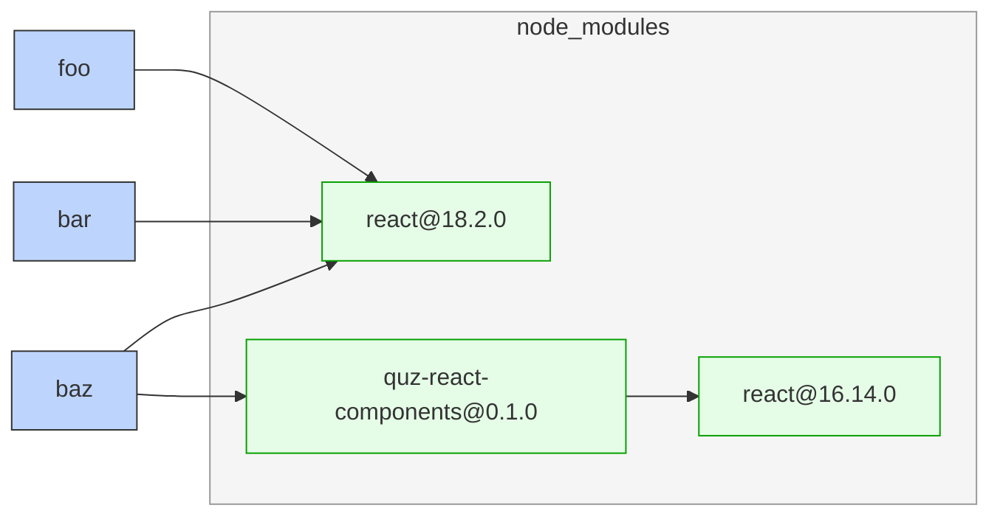

# Catalogs: Shareable dependency version specifiers

## Summary

"_Catalogs_" allow multiple `package.json` files to share the same version specifier of a dependency through a new `catalog:` protocol.

A catalog may be defined in `pnpm-workspace.yaml`:

```yaml
packages:
  - packages/*

catalog:
  react: ^18.2.0
  react-dom: ^18.2.0
  redux: ^4.2.0
  react-redux: ^8.0.0
```

A package referencing the catalog above will have the following on-disk and in-memory representations.

**On-Disk**

```json
{
  "name": "@example/react-components",
  "dependencies": {
    "react": "catalog:",
    "redux": "catalog:"
  }
}
```

**In-Memory and Publish Time**

```json
{
  "name": "@example/react-components",
  "dependencies": {
    "react": "^18.2.0",
    "redux": "^4.2.0",
  }
}
```

## Motivation

### Synchronization

A common workflow in monorepos is the need to synchronize on the same version of a dependency.

For example, the `foo` and `bar` packages of a monorepo may declare the same version of `react` in their `package.json` files.

```json
{
  "name": "@monorepo/foo",
  "dependencies": {
    "react": "^18.2.0",
  }
}
```

```json
{
  "name": "@monorepo/bar",
  "dependencies": {
    "react": "^18.2.0",
  }
}
```

For smaller monorepos with a few packages, it's easy to manually ensure these versions stay in sync. For monorepos with hundreds of packages and many contributors, it becomes untenable to rely on code review to ensure every dependency has a single version for all packages.

As a result, multiple versions of the same dependency appear over time. This can cause different flavors of surprising problems.

- In projects that bundle dependencies, multiple versions inflate the size of the final result deployed to users.
- Differing versions result in multiple copies that may not interact well at runtime, especially if features like [`Symbol()`](https://developer.mozilla.org/en-US/docs/Web/JavaScript/Reference/Global_Objects/Symbol) are used. For example, [React hooks will error if a component is rendered with a different copy of React in the same app](https://reactjs.org/warnings/invalid-hook-call-warning.html#duplicate-react).
- For TypeScript, multiple copies of the same `@types` package causes compile errors from mismatching definitions. The compiler diagnostic for this is usually: *"argument of type `Foo` is not assignable to parameter of type `Foo`"*. For developers that have seen this before, they may realize this diagnostic is due to a dependency version mismatch. For developers new to TypeScript, *"`Foo` is not assignable to `Foo`"* is very confusing.

While there are situations differing versions are intentional, this is more often accidental. Multiple differing versions arise from not reviewing `pnpm-lock.yaml` file changes or not searching for existing dependency specifiers before adding a new one. The later is typically unwritten convention in most monorepos.

### Merge Conflict Resistance

In addition to reducing the likelihood of multiple versions of the same dependency in a monorepo, the new `catalog:` protocol reduces merge conflicts. Any `package.json` files using the catalog protocol to declare a dependency do not need to be edited when changing the version of that dependency. This side steps `package.json` merge conflicts by avoiding edits to them in the first place.

**Merge conflict resistance is a primary motivator for introducing catalogs as a first-class feature to pnpm.** This is only possible through a new specifier protocol. See [_What kinds of merge conflicts are avoided?_](#what-kinds-of-merge-conflicts-are-avoided) for details.

## Detailed Explanation

### Configuring Catalogs

Catalogs are configured in `pnpm-workspace.yaml` and available to all workspace packages.

A default or unnamed catalog can be specified using the `catalog` config.

```yaml
packages:
  - packages/*

# These dependencies can be referenced through "catalog:default" or "catalog:"
catalog:
  jest: ^29.6.1
  redux: ^4.2.0
  react-redux: ^8.0.0
```

Additionally, named catalogs can be created by adding a `namedCatalog` config. Any named catalog will be available for reference through the `catalog:<name>` version specifier protocol.

```yaml
packages:
  - packages/*

# Can be referenced through "catalog:default" or "catalog:"
catalog:
  jest: ^29.6.1
  redux: ^4.2.0
  react-redux: ^8.0.0

namedCatalogs:
  # Can be referenced through "catalog:react17"
  react17:
    react: ^17.0.2
    react-dom: ^17.0.2

  # Can be referenced through "catalog:react18"
  react18:
    react: ^18.2.0
    react-dom: ^18.2.0
```

The default catalog specified directly under `catalog` has special treatment; package authors can specify `catalog:` if they prefer conciseness, or `catalog:default` for explicitness. Attempting to create a named catalog of `default` under `namedCatalogs` will throw an error.

### What kinds of merge conflicts are avoided?

Suppose a git commit upgrades the version of a commonly used dependency for all workspace packages. Suppose another git commit at the same time is attempting to perform any of the following:

1. Change the version of a dependency line-adjacent to the upgraded dependency.
2. Add or remove a dependency line-adjacent to the upgraded dependency.
3. Add a new declaration of the upgraded dependency.

Scenarios 1 and 2 will result in a git merge conflict that prevents these two commits from merging. This will not be the case when using the `catalog:` protocol.

Scenario 3 will result in an inconsistent/lockfile, which is not prevented by this RFC.

## Rationale for First-Class Support

While there's existing tooling in the frontend ecosystem for reusing versions ([`syncpack`](https://github.com/JamieMason/syncpack) being one great option), builtin support from pnpm allows several improvements not otherwise possible.

### 1. Eliminates a Synchronization Build Step

As mentioned in [_Motivations — Merge Conflict Resistance_](#merge-conflict-resistance), the new `catalog:` protocol enables `package.json` files to remain unchanged when upgrading or downgrading a dependency. Existing approaches typically synchronize `package.json` dependencies by editing them in bulk.

For example, developers may find + replace `"react": "^18.1.0"` to `"react": "^18.2.0"` across a repository.

- These giant edits lead to churn in `package.json` files and merge conflicts with other commits editing `package.json` files.
- Repository maintainers have to remember to run this synchronization step periodically, or create a Continuous Integration step to verify the repo is in a good state.

Neither of these error-prone operations are necessary when using a catalog.

### 2. Intention becomes clear

There might be a tight relationship between `foo` and `bar`.

```json5
{
  "name": "@monorepo/foo",
  "dependencies": {
    "react": "^17.0.2"
  }
}
```

```json5
{
  "name": "@monorepo/bar",
  "dependencies": {
    "react": "^17.0.2"
  }
}
```

A developer working primarily in `@monorepo/bar` may not realize the implied coupling and upgrade `@monorepo/bar` to `react@18` without realizing an edit to `@monorepo/foo` was also required.

The `catalog:` protocol makes it more clear from just reading `package.json` when a dependency is intended to be consistent across the monorepo. Ideally this person would search "_catalog package.json_" online and find pnpm.io docs.

## Implementation

### Lockfile

Catalogs will be saved to `pnpm-lock.yaml` under a new `catalogs` key. This allows users to more easily review changes to catalogs and pnpm to perform faster up-to-date checks.

```yaml
lockfileVersion: next

importers:

  packages/foo:
    dependencies:
      react:
        specifier: 'catalog:'
        version: ^18.2.0

catalogs:

  default:
    react:
      specifier: ^18.2.0
    react-dom:
      specifier: ^18.2.0
    redux:
      specifier: ^4.2.0
    react-redux:
      specifier: ^8.0.0

packages:
  # ...
```

### Other Changes

Similar to the [`workspace:` protocol](https://pnpm.io/workspaces#workspace-protocol-workspace), `pnpm publish` will need to replace instances of `catalog:` with valid specifiers before publishing.

### Add and update commands

The `pnpm add` command will add versions from default catalog if it's configured. The `pnpm update` command will prompt users if they wish to update specifiers in a catalog.

## Extensions

### Merge Conflict Resistance in the Lockfile

Although `package.json` files do not need to be updated when a catalog version changes, the `pnpm-lock.yaml` file will continue to require updates to affected `importers` entries.

```yaml
lockfileVersion: next

importers:

  packages/foo:
    dependencies:
      react:
        specifier: 'catalog:default'
        version: 18.2.0 # ← If a user changes the catalog entry for react, this field needs to change.

catalogs:

  default:
    react:
      specifier: ^18.2.0

packages:
```

This means it's still possible for the `pnpm-lock.yaml` file to end up in an inconsistent/broken state after two git commits merge. This is technically a "merge conflict", but not one in the scope of git to detect.

```diff
--- a/pnpm-lock.yaml
+++ b/pnpm-lock.yaml
 lockfileVersion: next
 
 importers:
 
   packages/foo:
     dependencies:
       react:
         specifier: 'catalog:default'
         version: 18.2.0
 
+  packages/bar:
+    dependencies:
+      react:
+        specifier: 'catalog:default'
+        version: 17.0.1 # ← This field is incorrect
+
 catalogs:
 
   default:
      react:
        specifier: ^18.2.0
 
 packages:
```

The RFC in its current state describes how `catalog:` significantly reduces merge conflicts to `package.json` files. There are ways to reduce merge conflicts and churn in `pnpm-lock.yaml`, but not in a known way that's simple.

One option that may be explored is further normalization by the recording resolved concrete versions to the `catalogs` portion of the lockfile.

```yaml
lockfileVersion: next

importers:

  packages/foo:
    dependencies:
      react:
        specifier: 'catalog:default'
        version: 'catalog:default'

  packages/bar:
    dependencies:
      react:
        specifier: 'catalog:default'
        version: 'catalog:default'

catalogs:

  default:
    react:
      specifier: ^18.2.0
      version: 18.2.0

packages:
```

The problem with the format above is that it does not represent [peer dependencies](https://nodejs.org/en/blog/npm/peer-dependencies#using-peer-dependencies) well:

```yaml
lockfileVersion: next

importers:

  packages/foo:
    dependencies:
      chai:
        specifier: 'catalog:default'
        version: 'catalog:default'
      chai-as-promised:
        specifier: 'catalog:default'
         # Replacing ↓ with catalog:default would remove valuable information.
        version: 7.1.1(chai@4.3.8)

catalogs:

  default:
    chai:
      specifier: ^4.3.8
      version: 4.3.8
    chai-as-promised:
      specifier: ^7.1.1
      version: 7.1.1

packages:
  /chai-as-promised@7.1.1(chai@4.3.8):
    # ...

  /chai@4.3.8:
    # ...
```

### Constraints

Catalog versions alone are insufficient to completely prevent multiple versions of the same dependency. Dependencies of dependencies (transitive dependencies) may pull in a package that already exists elsewhere in the dependency graph, but on a different version.

For example, the `foo`, `bar`, and `baz` workspace packages may all be using a catalog version for `react` on `^18.2.0`. However, `baz` may depend on `quz-react-components`, which brings in an older version of React.



This scenario currently requires human intervention and is outside of the scope of this RFC. It's possible a future RFC proposal would address this. Such a new proposal would need to propose a configuration syntax for enforcing a single version throughout the full dependency graph.

## Alternatives

### Syncpack

[Syncpack](https://github.com/JamieMason/syncpack/) is a great open source tool for keeping `package.json` dependency specifiers in sync on disk.

The proposed solution allows metadata to be defined in a singular file without copying definitions to other files on disk. This is a capability only possible by the package manager reading `package.json` files.

### Comparison to overrides/resolutions

An alternative mechanism for the version catalog is the [`pnpm.overrides` feature](https://pnpm.io/package_json#pnpmoverrides). While mechanically this allows you to set the version of a dependency across all workspace packages, it can be a bit unexpected if `pnpm.overrides` rewrites a dependency's dependency to an incompatible version silently.

`pnpm.overrides` is ultimately intended for a different purpose. The NPM RFC for a similar feature explicitly states that it should be used as a short-term hack to fix vendor problems.

> Using this feature should be considered a hack in most cases, something that is done temporarily while waiting for a bug to be fixed, or to avoid excessive duplication caused by an overly strict meta-dependency specifier.
https://github.com/npm/rfcs/blob/main/accepted/0036-overrides.md

The `catalog:` protocol is conversely intended for long-lived usage.

## Prior Art

- The Gradle build tool has a [similar concept called _version catalogs_](https://docs.gradle.org/current/userguide/platforms.html#sub:central-declaration-of-dependencies). This RFC's name was [directly chosen as inspiration](https://github.com/pnpm/pnpm/issues/2713#issuecomment-1341476866).
- Syncpack as mentioned above in the [alternatives section](#syncpack).
- Rush has a ["Preferred versions" concept](https://rushjs.io/pages/advanced/preferred_versions/) that works similarly.
- Rust allows users to define a [`[workspace.dependencies]` "_table_"](https://doc.rust-lang.org/cargo/reference/workspaces.html#the-dependencies-table). Members of the workspace can then [inherit its entries](https://doc.rust-lang.org/cargo/reference/specifying-dependencies.html#inheriting-a-dependency-from-a-workspace).
