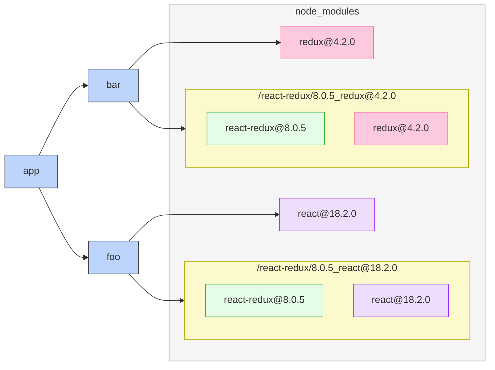
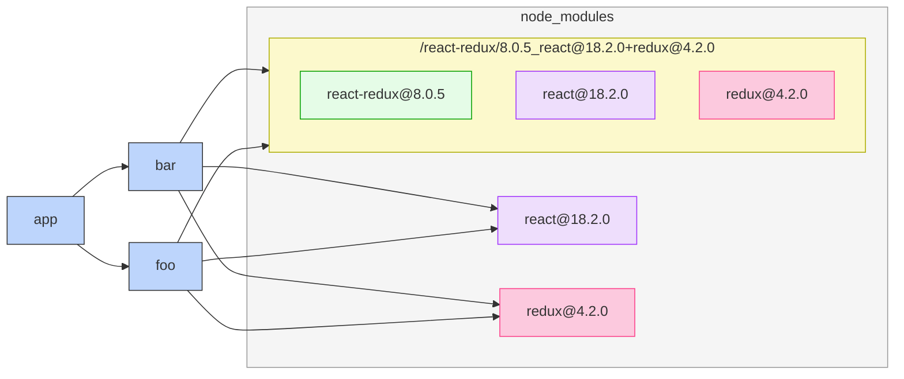
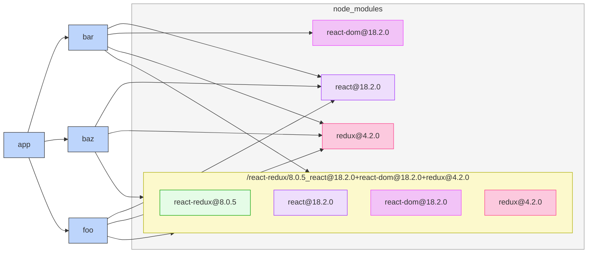

# Peer Dependency Sharing

## Summary

"_Peer Dependency Sharing_" is a relaxation of pnpm's strict dependency structure to balance usability with peer dependencies. It provides a mechanism to grant dependencies visibility into a peer dependency that was brought into a monorepo through a different dependency.

## Motivation

<!-- Why are we doing this? What pain points does this resolve? What use cases does it support? What is the expected outcome? Use real, concrete examples to make your case! -->

When a dependency is declared in `package.json`, pnpm helpfully restricts the dependency's visibility of its peer dependencies to only the peer dependencies also declared in that `package.json` file.

### Example with react-redux

Take the `react-redux@8.0.5` package for example, which has several peer dependencies, all of which are optional:

```jsonc
// https://registry.npmjs.org/react-redux/8.0.5
{
  "name": "react-redux",
  "version": "8.0.5",
  "description": "Official React bindings for Redux",
  /// ...
  "peerDependencies": {
    "@types/react": "^16.8 || ^17.0 || ^18.0",
    "@types/react-dom": "^16.8 || ^17.0 || ^18.0",
    "react": "^16.8 || ^17.0 || ^18.0",
    "react-dom": "^16.8 || ^17.0 || ^18.0",
    "react-native": ">=0.59",
    "redux": "^4"
  },
  "peerDependenciesMeta": {
    "@types/react": { "optional": true },
    "@types/react-dom": { "optional": true },
    "react-dom": { "optional": true },
    "react-native": { "optional": true },
    "redux": { "optional": true }
  },
  // ...
}
```

When `react-redux` is added to a monorepo package, a specific copy of it is hard linked into `node_modules/.pnpm` depending on what other dependencies are declared in that package.

```jsonc
// packages/app/package.json
{
  "name": "app",
  "dependencies": {
    "bar": "workspace:*",
    "foo": "workspace:*"
  }
}
```

```jsonc
// packages/foo/package.json
{
  "name": "foo",
  "dependencies": {
    "react": "^18.2.0",
    "react-redux": "^8.0.5"
  }
}
```

```jsonc
// packages/bar/package.json
{
  "name": "bar",
  "dependencies": {
    "react-redux": "^8.0.5",
    "redux": "^18.0.0",
  }
}
```

This generates the following `pnpm-lock.yaml`:

```yaml
lockfileVersion: 5.4

importers:

  packages/app:
    specifiers:
      bar: workspace:*
      foo: workspace:*
    dependencies:
      bar: link:../bar
      foo: link:../foo

  packages/bar:
    specifiers:
      react-redux: ^8.0.5
      redux: ^4.2.0
    dependencies:
      react-redux: 8.0.5_redux@4.2.0
      redux: 4.2.0

  packages/foo:
    specifiers:
      react: ^18.2.0
      react-redux: ^8.0.5
    dependencies:
      react: 18.2.0
      react-redux: 8.0.5_react@18.2.0

packages:

  # ...

  # 👇 This copy is used for packages/foo
  /react-redux/8.0.5_react@18.2.0:
    # Omitted for brevity

  # 👇 This copy is used for packages/bar
  /react-redux/8.0.5_redux@4.2.0:
    # Omitted for brevity

```

On the file system, this looks like:

```
❯ tree      
.
├── node_modules
├── packages
│   ├── app
│   │   ├── node_modules
│   │   │   ├── bar -> ../../bar
│   │   │   └── foo -> ../../foo
│   │   └── package.json
│   ├── bar
│   │   ├── node_modules
│   │   │   ├── react-redux -> ../../../node_modules/.pnpm/react-redux@8.0.5_redux@4.2.0/node_modules/react-redux
│   │   │   └── redux -> ../../../node_modules/.pnpm/redux@4.2.0/node_modules/redux
│   │   └── package.json
│   └── foo
│       ├── node_modules
│       │   ├── react -> ../../../node_modules/.pnpm/react@18.2.0/node_modules/react
│       │   └── react-redux -> ../../../node_modules/.pnpm/react-redux@8.0.5_react@18.2.0/node_modules/react-redux
│       └── package.json
├── pnpm-lock.yaml
└── pnpm-workspace.yaml
```

Represented visually:



See [_How peers are resolved_](https://pnpm.io/how-peers-are-resolved) for more detail on pnpm's peer dependency resolution.

### Unexpected Runtime Conflict

The `react-redux` example was chosen specifically because duplicates of this package cause unexpected problems at runtime. `react-redux` uses a JavaScript `Symbol()` for communication between a store provider and hooks listening to the store. When multiple copies of `react-redux` are in the same Webpack bundle, it encounters a mismatch of these `Symbol()` objects and crashes the React component tree upon render.

This means in practice, both the `bar` and `foo` examples above need to specify `react@18.2.0` and `redux@4.2.0` dependencies.

```jsonc
// packages/foo/package.json
{
  "name": "foo",
  "dependencies": {
    "react": "^18.2.0",
    "react-redux": "^8.0.5",
  },
  "devDependencies": {
    "redux": "^4.2.0"
  }
}
```

```jsonc
// packages/bar/package.json
{
  "name": "bar",
  "dependencies": {
    "react-redux": "^8.0.5",
    "redux": "^4.2.0"
  },
  "devDependencies": {
    "react": "^18.2.0",
  }
}
```

```yaml
lockfileVersion: 5.4

importers:

  packages/app:
    specifiers:
      bar: workspace:*
      foo: workspace:*
    dependencies:
      bar: link:../bar
      foo: link:../foo

  packages/bar:
    specifiers:
      react: ^18.2.0
      react-redux: ^8.0.5
      redux: ^4.2.0
    dependencies:
      react-redux: 8.0.5_react@18.2.0+redux@4.2.0
      redux: 4.2.0
    devDependencies:
      react: 18.2.0

  packages/foo:
    specifiers:
      react: ^18.2.0
      react-redux: ^8.0.5
      redux: ^4.2.0
    dependencies:
      react: 18.2.0
      react-redux: 8.0.5_react@18.2.0+redux@4.2.0
    devDependencies:
      redux: 4.2.0


packages:

  # 👇 One entry of react-redux@8.0.5 for both packages/bar and packages/foo now.
  /react-redux/8.0.5_react@18.2.0+redux@4.2.0:
    # Omitted for brevity

```




### Scaling Deduplication

Ensuring one unique hard-link copy of a dependency such as `react-redux` is difficult in practice. To so so, all projects in the workspace need to declare the same set of peer dependencies visible to `react-redux`, which is difficult to scale.

- When a monorepo has hundreds of contributors, (some which may be new to frontend development) not every developer understands the format of `pnpm-lock.yaml`, when a duplicate is created, or what set of dependencies need to be added to `package.json` to deduplicate. Deduplication efforts from one developer can be easily regressed by another.
- When a peer dependency is added to a new `package.json`, that peer dependency **has to be added to existing `package.json` files**. Suppose a new package `packages/baz/package.json` has `react-redux`, `redux`, and `react`, **and `react-dom`**. In this case, `react-dom` would need to be added to the previously mentioned `foo` and `bar` packages. This becomes difficult to scale when a monorepo grows to hundreds of packages.

Taking the `baz` and `react-dom` example further, the inclusion of this new package requires modifications to `foo` and `bar`, which is surprising.

```yaml
lockfileVersion: 5.4

importers:

  packages/app:
    specifiers:
      bar: workspace:*
      baz: workspace:*
      foo: workspace:*
    dependencies:
      bar: link:../bar
      baz: link:../baz
      foo: link:../foo

  packages/bar:
    specifiers:
      react: ^18.2.0
      react-dom: ^18.2.0 # 👈 bar also needs to declare react-dom because of baz
      react-redux: ^8.0.5
      redux: ^4.2.0
    dependencies:
      react-redux: 8.0.5_react@18.2.0+react-dom@18.2.0+redux@4.2.0
      redux: 4.2.0
    devDependencies:
      react: 18.2.0
      react-dom: 18.2.0

  packages/baz:
    specifiers:
      react: ^18.2.0
      react-dom: ^18.2.0 # 👈 new dep
      react-redux: ^8.0.5
      redux: ^4.2.0
    dependencies:
      react: 18.2.0
      react-dom: 18.2.0
      react-redux: 8.0.5_react@18.2.0+react-dom@18.2.0+redux@4.2.0
      redux: 4.2.0

  packages/foo:
    specifiers:
      react: ^18.2.0
      react-dom: ^18.2.0  # 👈 bar also needs to declare react-dom because of baz
      react-redux: ^8.0.5
      redux: ^4.2.0
    dependencies:
      react: 18.2.0
      react-redux: 8.0.5_react@18.2.0+react-dom@18.2.0+redux@4.2.0
    devDependencies:
      redux: 4.2.0
      react-dom: ^18.2.0

packages:

  # 👇 One entry of react-redux@8.0.5 for packages/bar, packages/foo, and packages/baz.
  /react-redux/8.0.5_react@18.2.0+react-dom@18.2.0+redux@4.2.0:
    # Omitted for brevity
```



NOTE: The `react-dom` example above leaves out the fact that `react-dom` declares a required peer dependency on `react` for simplicity.

## Detailed Explanation

<!-- Describe the expected changes in detail -->

As an alternative to manually maintaining a consistent set of dependencies for a dependency with peer dependencies, a new `sharePeerDependencies` option would allow that dependency to resolve any of its peer dependencies that are brought into the monorepo through any path.

```json
{
  "pnpm": {
    "sharePeerDependencies": {
      "enabled": true,
      "exclude": [],
    },
  }
}
```

When this feature is enabled for the examples above, one copy of `react-redux` is used despite the package it's used in.

```yaml
lockfileVersion: 5.4

importers:

  packages/app:
    specifiers:
      bar: workspace:*
      baz: workspace:*
      foo: workspace:*
    dependencies:
      bar: link:../bar
      baz: link:../baz
      foo: link:../foo

  packages/bar:
    specifiers:
      react-redux: ^8.0.5
      redux: ^4.2.0
    dependencies:
      react-redux: 8.0.5_react@18.2.0+redux@4.2.0
      redux: 4.2.0

  packages/baz:
    specifiers:
      react-redux: ^8.0.5
    dependencies:
      react-redux: 8.0.5_react@18.2.0+redux@4.2.0

  packages/foo:
    specifiers:
      react: ^18.2.0
      react-redux: ^8.0.5
    dependencies:
      react: 18.2.0
      react-redux: 8.0.5_react@18.2.0+redux@4.2.0

packages:

  /react/18.2.0:
    # Omitted for brevity

  # 👇 One entry due to peer dependency sharing.
  /react-redux/8.0.5_react@18.2.0+redux@4.2.0:
    # Omitted for brevity

  /redux/4.2.0:
    # Omitted for brevity

```

An `exclude` option disables this functionality for specific packages.

```json
{
  "pnpm": {
    "sharePeerDependencies": {
      "enabled": true,
      "exclude": ["react-redux@^8.0.5"],
    },
  }
}
```

Or alternatively:

```json
{
  "pnpm": {
    "sharePeerDependencies": {
      "enabled": true,
      "only": ["react-redux@^8.0.5"],
    },
  }
}
```

## Rationale and Alternatives

<!-- Discuss 2-3 different alternative solutions that were considered. This is required, even if it seems like a stretch. Then explain why this is the best choice out of available ones. -->

Peer dependency sharing makes tradeoffs that can introduce other problems. It might be surprising when packages such as `react-redux` suddenly have the ability to import a dependency brought in from a different unrelated portion in the monorepo. While this form of sharing can certainly be a foot gun, the alternative of accidentally duplicating is much riskier for packages such as `react-redux`.

### Satisfy peer dependencies from the workspace root

Today, peer dependencies can be satisfied if [`resolve-peers-from-workspace-root`](https://github.com/pnpm/pnpm/pull/5882) is set and if the peer was added to the root `package.json`.

However, adding a dependency to the root `package.json` allows any package to import it, opting out of the strict dependency management benefits of pnpm. Peer dependency sharing is similar to adding a root `package.json` with `resolve-peers-from-workspace-root=true`, but is a bit stricter. It prevents all packages and dependencies from importing the peer — only dependencies declaring that peer as a peer dependency can resolve it.

### Hoisting

Hoisting peers would achieve a similar result. Similar to resolving dependencies declared in the workspace root, this still dangerous since every package would be able to resolve the peer despite whether or not they declare a dependency on it.

## Implementation

<!-- Give a high-level overview of implementation requirements and concerns. Be specific about areas of code that need to change, and what their potential effects are. Discuss which repositories and sub-components will be affected, and what its overall code effect might be. -->

<!-- THIS SECTION IS REQUIRED FOR RATIFICATION -- you can skip it if you don't know the technical details when first submitting the proposal, but it must be there before it's accepted -->

- Which version is resolved if multiple conflict?
- What if a version exists, but isn't compatible?
- Filtering?
- Peer dependencies of in-repo packages?

## Prior Art

<!-- This section is optional if there are no actual prior examples in other tools -->

<!-- Discuss existing examples of this change in other tools, and how they've addressed various concerns discussed above, and what the effect of those decisions has been -->

## Unresolved Questions and Bikeshedding

<!-- Write about any arbitrary decisions that need to be made (syntax, colors, formatting, minor UX decisions), and any questions for the proposal that have not been answered. -->

<!-- THIS SECTION SHOULD BE REMOVED BEFORE RATIFICATION -->

